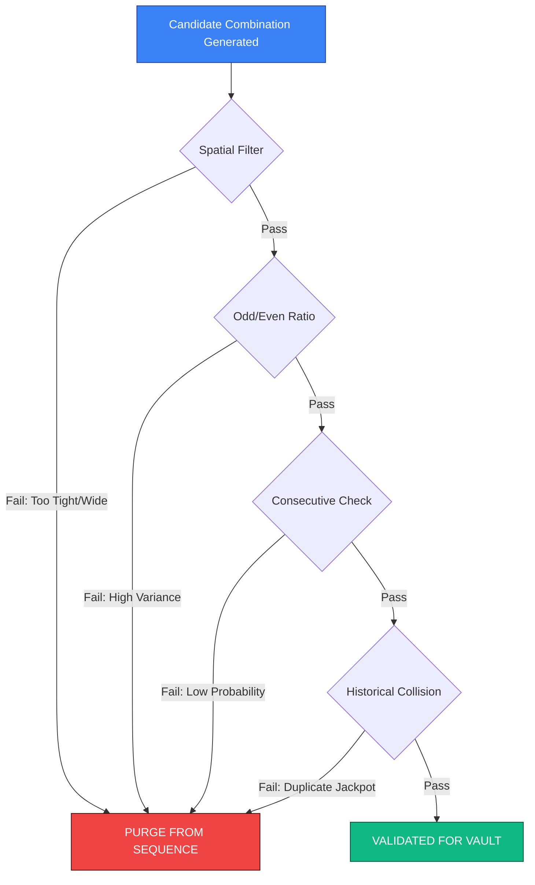

# Oracle Technical Diagrams: [Dead Zone Report]

## 01. THE VARIANCE FILTER (VSL Graphic)
**Concept:** Why the Quick Pick fails vs. why the Oracle wins.

```mermaid
graph LR
    subgraph Raw Randomness [Quick Pick Distribution]
        R1[Random Seed] --- R2((Dead Zone))
        R1 --- R3((Dead Zone))
        R1 --- R4((Mathematical Pocket))
    end

    Raw Randomness --> SCOUTER{Pattern Scouter}

    subgraph The Purge [The Oracle Filter]
        SCOUTER -->|PURGE| P1[Spatial Outliers]
        SCOUTER -->|PURGE| P2[Consecutive Noise]
        SCOUTER -->|PURGE| P3[Historical Collisions]
    end

    SCOUTER -->|EXTRACT| VAULT[(THE VAULT: Statistical Gold)]

    style Raw Randomness fill:#1e293b,stroke:#334155,color:#fff
    style The Purge fill:#450a0a,stroke:#ef4444,color:#fff
    style VAULT fill:#0f172a,stroke:#38bdf8,color:#38bdf8,stroke-width:4px
```

---

## 02. THE DUAL-ENGINE SYNCHRONIZATION
**Concept:** The mechanical flow from Data to Ticket.

```mermaid
graph TD
    DB[(GCP Cloud SQL: 10Y History)] --> PROPHET[THE PROPHET ENGINE]
    
    subgraph Analysis Phase
        PROPHET --> M[Markov Transition Scopes]
        PROPHET --> P[Poisson Overdue Tension]
        M & P --> SCORER{Weighted Scorer}
    end

    SCORER --> POOL[15-Number Smart Pool]
    
    POOL --> PRAGMATIST[THE PRAGMATIST ENGINE]
    
    subgraph Deployment Phase
        PRAGMATIST --> WHEEL[Combinatorial Wheeling]
        WHEEL --> BATCH[Multi-Tier Coverage Batch]
    end

    BATCH --> DISPLAY[Dashboard Deployment]

    style DB fill:#111827,stroke:#374151
    style PROPHET fill:#1e3a8a,stroke:#3b82f6,color:#fff
    style PRAGMATIST fill:#4c1d95,stroke:#8b5cf6,color:#fff
    style POOL fill:#064e3b,stroke:#10b981,color:#fff
```



---

## 03. THE SCOUTER'S GAUNTLET
**Concept:** The 4 critical hurdles of the mathematical scouter.


